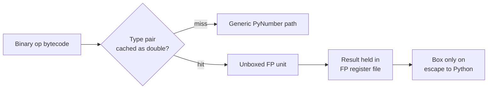

# nbody & pyflate — Baseline and Bottleneck Analysis

2026-09-18

On the course QEMU guest, nbody runs 477 ms per call and pyflate 3.14 s. Only 11.4% of nbody's runtime is the floating-point arithmetic the algorithm actually needs; the remaining 88.6% is interpreter overhead. In pyflate, 20.0% of the profile is an artifact of the `--with-pydebug` interpreter and is excluded from every bottleneck figure below.

---

## Environment and tooling

Everything below was measured on a single-vCPU QEMU/KVM guest, which sets the noise floor at roughly 2 to 3% and rules out any claim smaller than that.

| Component | Value |
| --- | --- |
| Host CPU | Intel Xeon E5-2630 v3 @ 2.40 GHz (Haswell) |
| vCPUs exposed to guest | 1 |
| Guest OS | Ubuntu 22.04.5 LTS, kernel 5.15.0-1106-kvm |
| Interpreter | CPython 3.10.12, 64-bit, built `--with-pydebug`, `CFLAGS=-g -Og` |
| Harness | pyperformance 1.14.0, pyperf 2.10.0 |
| Profiler | perf 5.15.200, `perf_event_paranoid=4`, `kptr_restrict` restricted |

The interpreter is a debug build (`python3.10d`). That choice is required by the course setup, but it installs a debug memory allocator that fills every allocated and freed block with marker bytes and checks the GIL on each allocation, plus assert-only consistency checks. Those functions appear in the profiles and are separated out everywhere below.

**nbody** simulates five bodies (the sun and four gas giants) under gravity. One benchmark call runs `report_energy()`, then 20,000 `advance()` iterations, then `report_energy()` again. All state is Python floats held in lists, so the inner loop is pure-Python float arithmetic over list elements.

**pyflate** is a pure-Python DEFLATE and bzip2 decompressor. One call decompresses `interpreter.tar.bz2` and the benchmark verifies the result against a fixed MD5 digest, so a run that completes is a run that decoded correctly. Because the data file is bzip2, only `bzip2_main` executes; the DEFLATE half of the module is never entered. The hot paths are therefore Huffman symbol decoding and the bzip2 move-to-front stage, both built on Python lists and integers.

---

## Measurement method

The first measurement wrapped perf around the whole harness, which counted work that is not the benchmark. Replacing it with a single fixed-work process removed that error and made per-call instruction counts comparable between versions.

### What the first approach measured

The original command was `perf stat -r 10 ... python3-dbg -m pyperformance run --bench <name>`. One such run starts about 27 Python processes: pyperformance itself, four pip invocations, the pyperf manager, and 21 worker processes (one calibration plus 20 measurement workers). perf counted all of them.

Summing every timed warmup and value recorded in the run's JSON gives how much of that was actually benchmark code:

| | nbody | pyflate |
| --- | --- | --- |
| perf stat elapsed per run | 51.7 s | 277.8 s |
| Benchmark code across all 21 processes | 40.2 s | 263.6 s |
| Share that is benchmark code | 77.9% | 94.9% |
| Per-call instructions implied by the old method | 3.372 G | 17.053 G |
| Per-call instructions measured directly | 2.909 G | 16.784 G |
| Over-count | +15.9% | +1.6% |

Three consequences followed. Counters could not be compared between the two benchmarks, because one profile was 22% contaminated and the other 5%. An optimisation would have been under-reported, since the fixed harness cost does not shrink when the benchmark gets faster. And pyperf re-calibrates its loop count whenever a call drops below 100 ms, so the amount of work being counted could change silently between versions. The corruption was visible directly in the nbody profile, which contained samples from `lsb_release`, `dpkg-query` and `uname`.

### The fixed-work replacement

perf is now pointed at a single pyperf worker process with loops, warmups and values pinned on the command line:

```
python -u <bench>/run_benchmark.py --worker -l 1 -w 1 -n <N>
```

`-l 1` reproduces the loop count pyperf's own calibration chose (the run metadata records `loops = 1` for both benchmarks). `-w 1 -n N` means the process performs exactly `N + 1` benchmark calls and nothing else: no pip, no calibration, no manager. N is 100 for nbody and 20 for pyflate, chosen so each profile collects a comparable number of samples. **Every optimised variant must use the identical flags for its benchmark**, or the instruction counts describe different amounts of work.

### Why the profiling event is named explicitly

The guest exposes an Intel PMU, so `perf stat` returns real cycle and instruction counts. It does not deliver sampling interrupts. `perf record` without `-e` therefore opens the hardware `cycles` event successfully, never falls back to a software event, and captures **zero samples** with no error. Profiling uses `-e cpu-clock -F 199` explicitly, which is the same software event the earlier baseline happened to land on, so old and new profiles remain comparable.

### Two kinds of number, kept separate

Timing comes from a normal `pyperformance run`, which calibrates loops and reports a mean across 20 independent processes with randomised memory layout. Counters and profiles come from the fixed-work worker run. The two are never mixed: the first answers how much faster, the second answers which instructions disappeared.

### Validation

| Check | Result |
| --- | --- |
| task-clock explained by calls x pyperf mean | 99.4% (nbody), 98.4% (pyflate) |
| Per-call instructions, nbody at `-n 20` vs `-n 100` | 2.937 G vs 2.909 G, 0.97% apart |
| Eval-loop share, nbody at `-n 20` vs `-n 100` | 45.14% vs 44.75%, 0.39 points apart |
| Lost samples in either profile | 0 |

The eval-loop share also moves in the predicted direction. In the contaminated baseline `_PyEval_EvalFrameDefault` was 37.09% of nbody; dividing by the 0.779 benchmark fraction predicts at most 47.6%, and the clean measurement gives 44.75%. It sits just below the ceiling because the harness processes run some interpreter loop of their own. For pyflate, which was only 5% contaminated, the figure barely moves: 23.52% before, 23.63% after.

---

## Baseline results

nbody runs 478 ms per call and pyflate 3.14 s. The two are shaped very differently: nbody's working set fits in cache and its cost is instruction throughput, while pyflate is memory-hungry and misses cache 4x more often per reference.

### Timing

Timing is the pyperformance mean across 20 worker processes. Nine independent runs of each benchmark gave 477 to 484 ms for nbody and 3.12 to 3.20 s for pyflate, so the run-to-run spread is about 1.5% for nbody and 2.5% for pyflate. Two of the nine pyflate runs raised `WARNING: the benchmark result may be unstable`.

One caveat on the headline figure: the first baseline capture reported nbody as 480 ms +- 11 ms, but that standard deviation comes from a single 559 ms value among 60. Every other run reported +- 1 to 3 ms. The median, 477 ms, is the honest number to quote.

### Hardware counters

All counters below come from the fixed-work worker runs, averaged over three repetitions, with per-call figures derived by dividing by the number of calls in the process (101 for nbody, 21 for pyflate).

| Counter | nbody | pyflate |
| --- | --- | --- |
| Calls in process | 101 | 21 |
| task-clock (s) | 48.44 | 67.00 |
| Time per call (ms) | 479.6 | 3190.4 |
| Instructions (G) | 293.8 | 352.5 |
| Instructions per call (G) | 2.909 | 16.784 |
| Cycles (G) | 115.5 | 159.6 |
| IPC | 2.54 | 2.21 |
| Branches (G) | 66.9 | 84.7 |
| Branches as share of instructions | 22.8% | 24.0% |
| Branch-miss rate | 0.48% | 0.49% |
| Cache references (M) | 11.1 | 165.6 |
| Cache references per 1K instructions | 0.038 | 0.470 |
| Cache-miss rate | 1.91% | 7.53% |
| LLC misses per 1K instructions | 0.0007 | 0.0354 |
| Page faults | 3,923 | 127,915 |
| Context switches | 351 | 495 |

### What the counters say

nbody barely touches memory. It issues 0.038 cache references per 1,000 instructions and misses 1.91% of them, giving 0.0007 last-level misses per 1,000 instructions. Five bodies and their vectors fit comfortably in L1, so the benchmark is bound by how many instructions the interpreter must execute, not by data movement. An accelerator that reduces memory traffic would gain nothing here.

pyflate is the opposite case. It issues 12x more cache references per instruction than nbody and misses 4x more often, for 50x the last-level miss rate. Its 127,915 page faults against nbody's 3,923 show the same thing from the allocator's side: the decoder grows a large output list and the repeated `out += out[-distance:]` copy keeps touching new memory. This is the quantitative basis for treating pyflate as a data-movement problem and nbody as a compute problem.

One caution on the branch figures. Both benchmarks mispredict under 0.5% of branches, which looks excellent, but roughly 23% of all instructions are branches. In a bytecode interpreter most of these are the eval loop's own dispatch, and the low miss rate reflects an indirect-jump-threaded interpreter running the same opcode sequence repeatedly. It does not mean there is no dispatch cost to remove; it means the cost is issue bandwidth rather than misprediction.

---

## nbody: where the time goes

The floating-point arithmetic the simulation actually requires is 11.4% of runtime. The other 88.6% is the cost of performing that arithmetic through a bytecode interpreter on boxed objects, which works out to roughly eight instructions of overhead for every instruction of physics.

Profile: 9,000 samples of `cpu-clock` at 199 Hz over 48.67 s, zero lost. Symbols are grouped by mechanism; percentages are self overhead, which is unaffected by the call-graph problem noted under threats to validity.

| Mechanism | Profile | Release-equiv | Instr/call |
| --- | --- | --- | --- |
| Interpreter dispatch | 44.75% | 46.5% | 1.302 G |
| Sequence element access | 12.35% | 12.8% | 0.359 G |
| Float boxing and refcounting | 11.91% | 12.4% | 0.346 G |
| **Real float arithmetic** | **11.00%** | **11.4%** | **0.320 G** |
| Operator dispatch | 10.51% | 10.9% | 0.306 G |
| Index to C integer | 4.91% | 5.1% | 0.143 G |
| Debug-build only | 3.70% | excluded | 0.108 G |
| Uncategorised tail | 0.82% | | |

Release-equivalent rescales each mechanism by dividing by 0.9630, the share of the profile that is not debug-build-only code, to estimate what a normal interpreter would show.

### What each group contains

**Interpreter dispatch** is `_PyEval_EvalFrameDefault` alone: fetching, decoding and dispatching bytecode, and maintaining the value stack.

**Float boxing and refcounting** is `PyFloat_FromDouble` (3.96%), `float_dealloc` (3.49%), `get_float_state` (1.58%), `_Py_NewReference` (1.49%) and `_Py_Dealloc` (1.39%). Every intermediate value in `dx * dx + dy * dy + dz * dz` becomes a heap-allocated `PyFloatObject` that is refcounted and freed microseconds later. Allocating and destroying the result costs slightly more than computing it.

**Real float arithmetic** is `float_mul` (3.94%), `float_add` (2.23%), `float_sub` (2.00%), `__ieee754_pow_fma` in libm (1.76%), `float_pow` (0.86%) and `pow` (0.21%). This is the only group a specialised FPU would already be doing.

**Operator dispatch** is `binary_op1` (5.85%), `binary_iop1` (1.46%), `PyNumber_Multiply` (1.27%) and the rest of the `PyNumber_*` family. This is the interpreter deciding, at runtime and for every single operation, which `__mul__` implementation applies to these two objects. The types never change across the entire run.

**Sequence element access** is `list_ass_item` (2.88%), `list_ass_subscript` (1.74%), `PyObject_GetItem` (1.57%), `PyObject_SetItem` (1.49%), `list_item` (1.49%), `list_subscript` (1.34%), `PyTuple_GetItem` (0.90%) and `listiter_next` (0.81%): reading and writing `r[0]`, `v1[2]` and the like through the generic sequence protocol.

**Index to C integer** is `PyNumber_AsSsize_t` (2.07%), `_PyNumber_Index` (1.60%) and `PyLong_AsSsize_t` (1.24%): unwrapping the Python integer `0` into a C `ssize_t` before it can index anything. The constants are literals in the source.

**Debug-build only** is `_Py_CheckSlotResult` (2.34%) plus the debug allocator's `_PyMem_DebugCheckAddress`, `read_size_t`, `write_size_t`, the GIL check reached through `pthread_getspecific`, and `validate_list`. None of it exists in a release interpreter and none of it is treated as a bottleneck.

### The structural finding

Group the numbers differently and the co-design case is clear. Boxing (12.4%), operator dispatch (10.9%), element access (12.8%) and index conversion (5.1%) come to **39.7%** of runtime, and every one of those exists only because values are generic heap objects reached through generic protocols. The types and shapes involved are fixed for the whole run: five bodies, three coordinates, all doubles. The interpreter rediscovers that fact millions of times.

---

## pyflate: where the time goes

One fifth of this profile, 19.96%, is code that exists only because the interpreter was built `--with-pydebug`. Three of the six largest symbols are debug-allocator functions. Any analysis that skips this correction concludes that pyflate is allocation-bound for a reason that disappears on a normal interpreter.

Profile: 13,000 samples of `cpu-clock` at 199 Hz over 67.97 s, zero lost.

| Mechanism | Profile | Release-equiv | Instr/call |
| --- | --- | --- | --- |
| Interpreter dispatch | 23.63% | 29.5% | 3.966 G |
| Function call machinery | 10.44% | 13.0% | 1.752 G |
| List and slice operations | 10.04% | 12.5% | 1.685 G |
| Memory allocator | 8.20% | 10.2% | 1.376 G |
| Integer and bit operations | 7.49% | 9.4% | 1.257 G |
| Dict lookup | 7.12% | 8.9% | 1.195 G |
| Debug-build only | 19.96% | excluded | 3.350 G |
| Uncategorised tail | 13.15% | | |

Release-equivalent divides by 0.8004, the non-debug share of the profile.

### What each group contains

**Debug-build only** is `_PyMem_DebugCheckAddress` (4.03%), `read_size_t` (2.93%), `__memset_avx2_unaligned_erms` (2.71%), `pthread_getspecific` (2.04%), `PyGILState_Check` (1.48%), `_PyMem_DebugRawAlloc` (1.25%), `write_size_t` (1.00%) and the remaining debug allocator entry points. The baseline capture's call graphs confirmed the attribution directly: `memset` is reached from `_PyMem_DebugRawFree` and `_PyMem_DebugRawAlloc` writing marker bytes, and `pthread_getspecific` is reached from `_PyMem_DebugCheckGIL`. In CPython 3.10 these hooks are installed only when `Py_DEBUG` is defined.

**List and slice operations** is `list_dealloc` (2.21%), `list_ass_slice` (2.13%), `list_item` (1.15%), `list_concat` (1.07%), `list_slice` (1.00%), `PySlice_New` (0.47%) and `PySlice_AdjustIndices` (0.37%). This is the bzip2 move-to-front stage. `move_to_front(l, c)` is called once per decoded symbol and rebuilds the entire list with `l[:] = l[c:c + 1] + l[0:c] + l[c + 1:]`: three slices, two concatenations and a slice assignment, over a list of up to 256 entries, for every symbol.

**Memory allocator** is the real, non-debug allocator underneath that: `_PyObject_Malloc` (2.23%), `arena_map_get` (1.45%), `arena_map_is_used` (0.79%), `_PyObject_Free` (0.64%), plus `_Py_NewReference`, `_Py_Dealloc` and glibc's `_int_malloc` and `_int_free`.

**Dict lookup** is `lookdict_unicode_nodummy` (3.11%), `_PyDict_GetItemHint` (1.00%), `lookdict_split` (0.86%) and `_PyType_Lookup` (0.70%): attribute and method resolution on the decoder's `HuffmanLength` and `Bitfield` objects.

**Function call machinery** is `call_function` (2.52%), `_PyObject_VectorcallTstate` (1.38%), `frame_dealloc` (1.33%), `_PyObject_GetMethod` (1.26%) and `_PyEval_MakeFrameVector` (1.15%): building and tearing down a Python frame for every call. `find_next_symbol`, `readbits` and `snoopbits` are called once per decoded symbol.

**Integer and bit operations** is `get_small_int` (1.29%), `_PyLong_New` (0.81%), `long_bitwise` (0.75%), `long_richcompare` (0.71%) and `PyLong_FromLong` (0.55%): the bit masking and shifting in `readbits`, performed on arbitrary-precision `PyLongObject` values.

The **uncategorised tail** is small generic work spread thinly: `binary_op1` (1.43%), `PyTuple_GetItem` (1.43%), `PyObject_RichCompare` (1.09%), bytes slicing, and the timsort symbols from the one `l.sort()` in `HuffmanTable.__init__` (about 0.4% in total). Nothing in it is large enough to support a proposal.

### The structural finding

pyflate spends its time moving data through Python object machinery. List and slice operations plus the allocator underneath them come to **22.8%** release-equivalent, and the operation being performed is moving a single element to the front of a list. The counters agree: 0.470 cache references per 1,000 instructions and a 7.53% miss rate, against nbody's 0.038 and 1.91%.

The second candidate is Huffman decoding. The benchmark's own docstring concedes that "there is certainly some room for improvement in the Huffman bit-matcher", and `find_next_symbol` linearly scans the symbol table for every symbol decoded, calling `snoopbits` on each candidate. That cost lands across dict lookup, call machinery and integer operations rather than in one symbol. Its size cannot be pinned down precisely from this data, for the reason given under threats to validity.

---

## Hardware proposals

Each proposal below names the profile groups it targets and states the Amdahl ceiling that follows: the best possible result if that hardware made the targeted work take zero time. No proposal is claimed to reach its ceiling.

| Proposal | Benchmark | Targets | Max speedup | Max runtime cut |
| --- | --- | --- | --- | --- |
| Unboxed float and index unit | nbody | 39.7% | 1.66x | 39.7% |
| Inverse-square-root unit | nbody | 2.8% | 1.03x | 2.8% |
| Move-to-front unit | pyflate | 22.8% | 1.30x | 22.8% |
| Huffman decode unit | pyflate | 21.9% | 1.28x | 21.9% |

### 1. Unboxed float and index unit (nbody)

Targets float boxing (12.4%), operator dispatch (10.9%), sequence element access (12.8%) and index conversion (5.1%).

The interpreter re-derives the same facts on every operation: that both operands are doubles, which `__mul__` applies, that the index literal is a small integer, and that the result must become a fresh heap object. The unit caches the resolved type pair for a bytecode site and, on a hit, computes on raw doubles held in a register file, boxing only when a value escapes to Python.



**Interface.** In: a bytecode site id, two object pointers, and the operation. Out: either an unboxed double retained in the register file, or a boxed `PyFloatObject` reference when the value escapes.

**Why it fits this workload.** The counters rule out a memory-side explanation: 0.038 cache references per 1,000 instructions and 0.0007 last-level misses. The cost is instruction count, and the unit removes instructions rather than stalls.

**Trade-offs.** It needs a type-cache structure per bytecode site, which costs area and adds a lookup on the fast path. It only pays off when types are stable; on polymorphic code it adds a check and falls back. Because the benchmark runs the same five bodies for 20,000 iterations, this workload is close to the best case, and the report should say so rather than generalise.

### 2. Inverse-square-root unit (nbody)

Targets `float_pow`, `__ieee754_pow_fma` and `pow`, which together are 2.8% of runtime. The expression `(dx*dx + dy*dy + dz*dz) ** (-1.5)` is an inverse square root followed by a reciprocal, and dedicated inverse-square-root hardware is standard in graphics and physics pipelines.

The ceiling is 1.03x. This is worth including as a targeted observation, but the honest conclusion is that it cannot carry a project on its own: the generic `pow` call is only 2.8% of the work even though it is the most mathematically distinctive operation in the benchmark. Stating that explicitly is a stronger result than inflating it.

### 3. Move-to-front unit (pyflate)

Targets list and slice operations (12.5%) and the allocator underneath them (10.2%).

Move-to-front is a standard bzip2 stage: keep a table of the 256 byte values, and on each decoded symbol move the entry at index `c` to position 0, shifting everything before it down one place. In hardware this is a shift register or a small CAM, and it completes in one cycle. The interpreter instead rebuilds the whole list through three slices and two concatenations, allocating five list objects and touching every element's refcount, once per decoded symbol.

**Interface.** In: the index `c` to promote. Out: the byte value that was at `c`, with the table updated in place. The table itself stays resident in the unit across the whole decode, so nothing crosses the interface except one index in and one byte out.

**Why it fits this workload.** pyflate issues 12x more cache references per instruction than nbody and misses 4x more often. Its 127,915 page faults against nbody's 3,923 come from exactly this allocation churn. The operation has a fixed, tiny working set (256 bytes) and is performed millions of times, which is the profile of something worth putting in hardware.

**Trade-offs.** A 256-entry shift register is cheap in area but the interpreter must be able to address it, which means the MTF table stops being an ordinary Python list and becomes state owned by the unit. That representation change is the real cost and the interesting co-design point. The unit is also single-purpose: outside bzip2, MTF appears rarely.

### 4. Huffman decode unit (pyflate)

Targets dict lookup (8.9%) and function call machinery (13.0%).

`find_next_symbol` scans the symbol table linearly, calling `snoopbits` for every candidate until one matches. A hardware Huffman decoder holds the code table and returns a symbol and its bit length in one operation, which is how real DEFLATE decoders are built.

**Caveat on the number.** The 13.0% function-call figure covers every Python call in pyflate, not only the ones in the bit-matcher. Attributing all of it to Huffman decoding is generous, and the true figure is lower. Splitting it precisely requires working call chains, which this capture does not have. The 1.28x ceiling should be presented as an upper bound with that stated.

### Combining them

The ceilings do not add. Removing one group raises the proportional share of everything left, so two units targeting 39.7% and 2.8% of nbody do not give 42.5% back. Each proposal is also independent of the interpreter dispatch cost, which stays at 46.5% of nbody and 29.5% of pyflate and is untouched by all four.

### Power and area

All four units add chip area and draw power while active. The defensible claim is about energy rather than power: a fixed-function unit completing in fewer cycles than the equivalent interpreter sequence uses less energy for the same work, even at higher instantaneous power. That argument holds for the move-to-front unit and the Huffman decoder, where the operation is well defined and repeated. It is weaker for the type-cache unit, whose benefit depends on hit rate and which pays a lookup cost on every miss.

---

## Threats to validity

Six limitations affect the numbers above. Three are environmental and cannot be removed here; three are fixable and listed as open work.

**The interpreter is a debug build.** Debug-only code is 3.70% of the nbody profile and 19.96% of pyflate's. The release-equivalent columns divide by the non-debug share, which assumes debug overhead is distributed proportionally across the remaining mechanisms. That is an approximation, and it is least safe for pyflate, where the debug allocator sits directly on the allocation-heavy path being analysed. Measuring rather than estimating this requires profiling the same benchmarks under `/usr/bin/python3` and comparing, which is listed below as open work.

**Call graphs in the worker captures are unusable.** Recorded with `-g`, which uses frame-pointer unwinding; the interpreter is built with `-Og`, which omits frame pointers, so the unwinder walks stack garbage. The children printed under `_PyEval_EvalFrameDefault` include values such as `0xdddddddddddddddd` and `0xfdfdfdfdfdfdfd00`, which are the debug allocator's own fill patterns being read as return addresses. Flat self-overhead percentages come from the sampled instruction pointer and are unaffected, so every figure in this document stands; but no call-chain claim can be made from these captures, and the Huffman attribution is bounded rather than exact for this reason. The earlier full-harness capture does have clean call chains and was used for the debug-allocator attribution in the pyflate section.

**Kernel symbols are unresolved.** `kptr_restrict` is set, so kernel addresses do not map to names and the analysis is user-space only. In the baseline capture, unresolved kernel time was 1.15% of nbody and 0.54% of pyflate, so the omission is small.

**The guest has one vCPU.** Run-to-run spread is about 1.5% for nbody and 2.5% for pyflate, and pyflate raised `WARNING: the benchmark result may be unstable` in two of nine runs. No improvement below roughly 3% should be claimed from this environment.

**Sampling error.** At 9,000 samples (nbody) and 13,000 (pyflate), every mechanism group in this document is above 4% and carries under 5% relative error. Individual symbols below 1% carry 10% or more and are quoted only as supporting detail.

**Mechanism grouping is a judgment.** Each symbol is assigned to exactly one group, so nothing is double-counted, but some boundaries are arguable. `_Py_NewReference` and `_Py_Dealloc` are counted as float boxing in nbody, where floats dominate allocation, and as allocator work in pyflate. The grouping script and the raw reports are kept so the assignment can be audited.

### Open work

1. Re-record both benchmarks with `--call-graph dwarf` instead of `-g`, to obtain usable flame graphs and to split the Huffman cost out of the general function-call figure.
2. Profile both benchmarks under the system release interpreter and compare against the debug build, replacing the estimated debug correction with a measured one.
3. Run the optimised variants with identical flags and compare per-call instruction counts against the baselines recorded here.

---

## Reproducing these numbers

```bash
PY=/root/sw-project/baseline/scripts/venv/cpython3.10-58f517067257-compat-31b33d68c68a/bin/python
BM=/root/sw-project/venv-dbg/lib/python3.10/site-packages/pyperformance/data-files/benchmarks

# Counters: three groups, since a 1-vCPU guest cannot multiplex more at once.
# nbody uses -n 100, pyflate -n 20. Optimised variants MUST reuse these flags.
for G in "task-clock,context-switches,page-faults,cycles,instructions" \
         "cache-references,cache-misses" \
         "branches,branch-misses"; do
  echo "=== $G ===" | tee -a nbody_worker_stat.txt
  perf stat -r 3 -e "$G" -- \
      $PY -u $BM/bm_nbody/run_benchmark.py --worker -l 1 -w 1 -n 100 \
      2>&1 | tee -a nbody_worker_stat.txt
done

# Profile: cpu-clock must be named explicitly, or zero samples are captured.
perf record -e cpu-clock -F 199 -g -o nbody.perf.data -- \
    $PY -u $BM/bm_nbody/run_benchmark.py --worker -l 1 -w 1 -n 100
perf report -i nbody.perf.data --stdio --no-children > nbody_worker_report.txt
```

`--no-children` produces the self-overhead column used throughout this document. Timing figures come separately from `pyperformance run -b <name>`, which calibrates its own loop count and must not be replaced by the worker command.

### Files this analysis is built from

| File | Contents |
| --- | --- |
| `nbody_worker_stat.txt`, `pyflate_worker_stat.txt` | perf stat, three counter groups, three repetitions each |
| `nbody_worker_report.txt`, `pyflate_worker_report.txt` | perf report, self overhead, fixed-work runs |
| `nbody_baseline.json`, `pyflate_baseline.json` | pyperformance timing runs, per-value data and environment metadata |
| `perf_stat.txt`, `perf_report_flat.txt` (baseline capture) | the original full-harness measurement, kept for the method comparison and its intact call chains |
